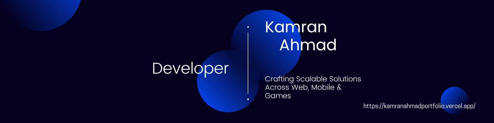

<!-- =========================================================== -->
<!-- 👋 HEADER 👋 -->
<!-- =========================================================== -->

<h1>👋 Hi, I'm <strong>Kamran Ahmad</strong></h1>
<h3>
    
</h3>

<!-- =========================================================== -->
<!-- 👇 INFO 👇 -->
<!-- =========================================================== -->
<ul>
  <li>🔭 Currently working at <strong>Nexcypher</strong> as a Developer</li>
  <li>🚀 Skilled in <strong>MERN Stack, React Native, Flutter (Dart), Unity (C#), and Web Scraping</strong></li>
  <li>🧠 Learning advanced <strong>development concepts</strong></li>
  <li>💬 Ask me about <strong>Full Stack Web, Cross-Platform Mobile Apps, and Game Development</strong></li>
  <li>📫 Reach me at <a href="mailto:kamrananwar2004@gmail.com" target="_blank">kamrananwar2004@gmail.com</a></li>
  <li>⚡ Fun fact: <strong>I think in 0s and 1s</strong></li>
</ul>

<!-- =========================================================== -->
<!-- 💻 BEAUTIFUL GROUPED ICONS TECH STACK 💻 -->
<!-- =========================================================== -->
<h1>💻 Tech Stack</h1>

<!-- 🎨 Frontend -->
<h3>🎨 Frontend</h3>

  

<!-- ⚙️ Backend -->
<h3>⚙️ Backend</h3>

  

<!-- 📱 Mobile & Game Dev -->
<h3>📱 Mobile & Game Development</h3>

  

<!-- 💾 Databases -->
<h3>💾 Databases</h3>

  

<!-- 🛠️ Languages -->
<h3>🛠️ Languages</h3>

  

<!-- 🔧 Tools -->
<h3>🔧 Tools</h3>

  

<!-- =========================================================== -->
<!-- 📈 STATS 📈 -->
<!-- =========================================================== -->
<h2>📊 GitHub Stats</h2>

<!-- =========================================================== -->
<!-- 🌐 CONNECT WITH ME 🌐 -->
<!-- =========================================================== -->
<h2>🌐 Connect with Me:</h2>

